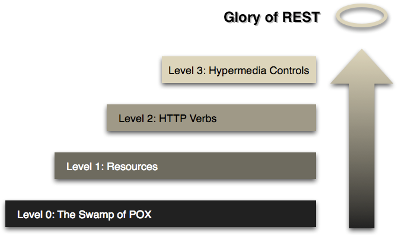

# Swapi with Fastify

Pierre Pineau - Leo Teixeira - Nathan Gaulard

# Sommaire

- Ridcharson
- Sentry
- Tests de Montée en Charge

## Modèle de Richardson

### Présentation 

Le modèle de Richardson est un modèle de maturité pour les API RESTful, qui a été proposé par Leonard Richardson en 2008. Il définit quatre niveaux de maturité pour les API REST, en se basant sur les principes de l'architecture REST et les bonnes pratiques de conception d'API.

### Niveau 0 : Services

Le niveau 0 correspond à l'utilisation de protocoles de communication standard, tels que SOAP, XML-RPC ou HTTP, pour exposer des services web. Ces services ne suivent pas les principes de l'architecture REST et ne sont pas considérés comme des API RESTful.

### Niveau 1 : Ressources

Le niveau 1 correspond à l'utilisation de ressources pour identifier les entités manipulées par l'API. Les ressources sont généralement identifiées par des URI, mais les opérations sur ces ressources ne suivent pas les principes de l'architecture REST.

### Niveau 2 : Verbes HTTP

Le niveau 2 correspond à l'utilisation des verbes HTTP pour définir les opérations sur les ressources. Cela signifie que les opérations de lecture, d'écriture, de mise à jour et de suppression sont définies en utilisant les verbes HTTP GET, POST, PUT et DELETE, respectivement.

### Niveau 3 : Hyperliens

Le niveau 3 correspond à l'utilisation des hyperliens pour représenter les relations entre les ressources. Cela signifie que les réponses renvoyées par l'API contiennent des hyperliens vers d'autres ressources liées, ce qui permet de naviguer dans l'API de manière dynamique.

## Sentry

1. **Détection d'Erreurs :** Sentry capture automatiquement les erreurs, les exceptions et les événements indésirables dans les applications.

2. **Informations Contextuelles :** Il fournit des informations détaillées sur les erreurs, y compris la trace de la pile, les variables, les informations de version, et d'autres métadonnées utiles pour faciliter la résolution des problèmes.

3. **Suivi des Performances :** Outre la gestion d'erreurs, Sentry propose également des fonctionnalités de suivi des performances pour aider à identifier les problèmes de performances dans les applications.

4. **Reporting en Temps Réel :** Sentry offre un reporting en temps réel des erreurs, permettant aux développeurs d'agir rapidement pour résoudre les problèmes.

5. **Versioning :** Il permet de lier les erreurs à des versions spécifiques de l'application, facilitant ainsi la traçabilité et la résolution des problèmes.

## Enjeux des tests de montée en charge

1. **Fiabilité du Système :** Les tests de montée en charge permettent de s'assurer que le système peut traiter un volume de demandes croissant sans compromettre sa fiabilité.

2. **Performance :** Ils visent à évaluer les performances du système, en termes de temps de réponse, de débit et de capacité de traitement.

3. **Évolutivité :** Ces tests permettent de déterminer la capacité du système à s'adapter à une augmentation de la charge, que ce soit en termes d'utilisateurs, de transactions ou de données.

4. **Détection de Problèmes :** Identifier les points de défaillance, les goulots d'étranglement et les limitations du système sous des charges élevées.

## Facteurs à considérer

1. **Charge simulée :** Déterminer la charge à laquelle le système sera soumis pendant les tests, en se basant sur des scénarios réalistes d'utilisation.

2. **Scénarios d'utilisation :** Définir des cas d'utilisation représentatifs pour s'assurer que le système est testé dans des conditions proches de la réalité.

3. **Infrastructure :** S'assurer que l'infrastructure sur laquelle les tests sont réalisés reflète les conditions de production autant que possible.

4. **Monitoring :** Mettre en place des outils de surveillance pour suivre les métriques clés pendant les tests, comme le temps de réponse, l'utilisation des ressources, etc.

5. **Éviter les effets de bord :** Assurer l'isolation des tests pour éviter que des problèmes externes n'affectent les résultats.

## Types de tests de montée en charge

1. **Test de Résistance :** Évaluer la capacité d'un système à fonctionner correctement sous une charge constante ou croissante sur une période prolongée.

2. **Test d'Endurance :** Mesurer la capacité du système à maintenir une charge constante sur une période prolongée sans perte de performance.

3. **Test de Pointe :** Tester la capacité du système à gérer des charges soudaines et importantes, souvent au-delà de la charge normale, pour évaluer la réaction en situations de surcharge.

4. **Test de Performance :** Évaluer les performances générales du système en mesurant des indicateurs tels que le temps de réponse, le débit, et la capacité à gérer un nombre spécifique de transactions.

## Outils de Monitoring Open-Source et Cloud

1. **[Prometheus :](https://prometheus.io/)** Prometheus est un système de monitoring et d'alerte open-source conçu pour les environnements cloud native. Il est conçu pour surveiller des systèmes dynamiques à grande échelle.

2. **[Grafana :](https://grafana.com/)** Grafana est un outil open-source de visualisation et de monitoring qui s'intègre parfaitement avec Prometheus et de nombreux autres systèmes de monitoring. Il offre des tableaux de bord personnalisables et des fonctionnalités d'alerte.

3. **[Zabbix :](https://www.zabbix.com/)** Zabbix est une plateforme open-source de monitoring réseau et d'applications qui permet de surveiller les performances et la disponibilité des serveurs, des réseaux et d'autres équipements informatiques.

## Outils de Test de Charge Open-Source

1. **[Apache JMeter :](https://jmeter.apache.org/)** Apache JMeter est un outil open-source de test de charge développé par la Fondation Apache. Il est conçu pour tester les performances des applications web et peut simuler un grand nombre d'utilisateurs simultanés.

2. **[Gatling :](https://gatling.io/)** Gatling est un outil open-source de test de charge écrit en Scala. Il est conçu pour effectuer des tests de performance en simulant des scénarios réalistes avec un grand nombre d'utilisateurs virtuels.

3. **[Locust :](https://locust.io/)** Locust est un outil open-source de test de charge écrit en Python. Il permet de simuler un grand nombre d'utilisateurs pour tester les performances des applications web.

## Project

- [Github Swapi with fastify](https://github.com/PierrePineau/swapi-fastify)

